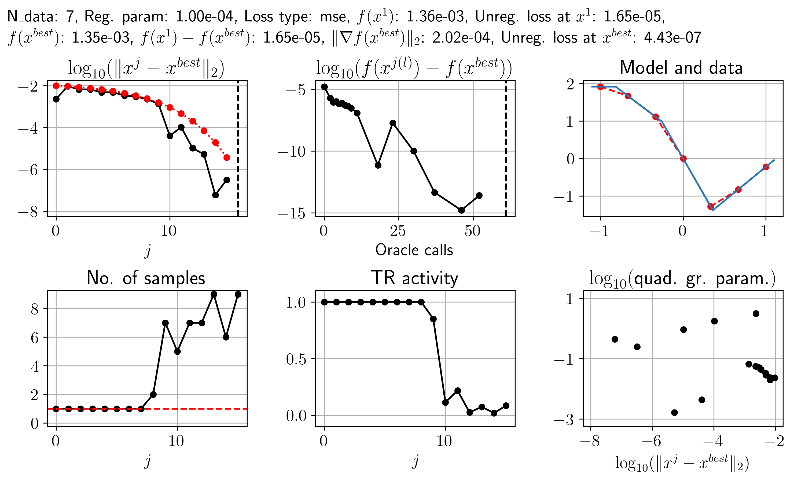
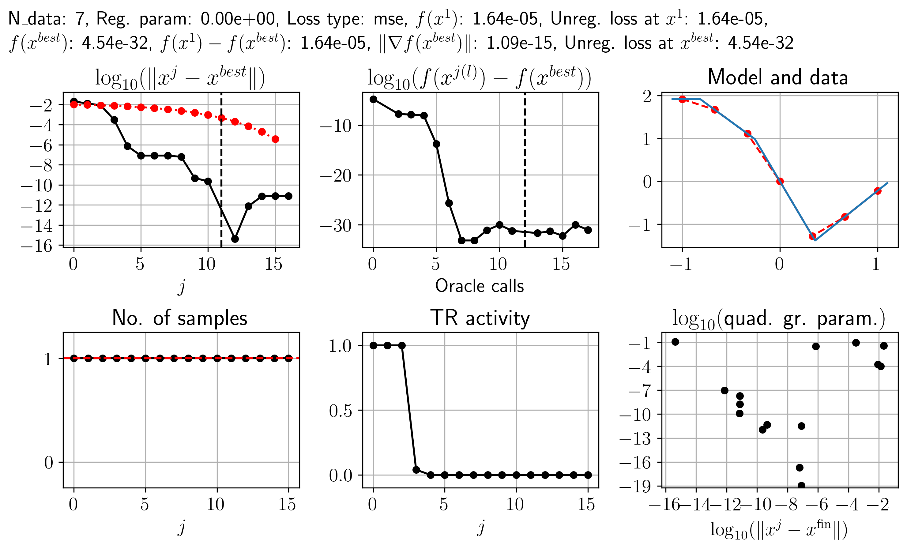
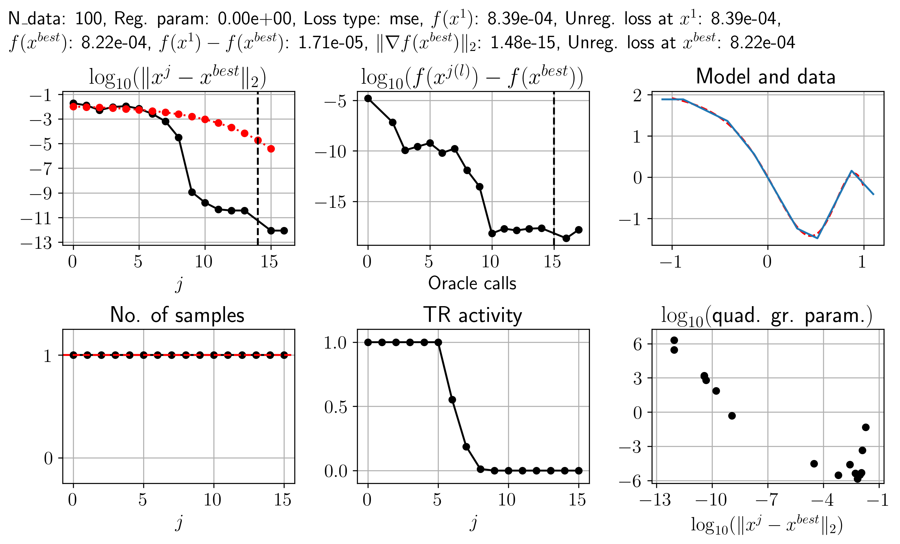
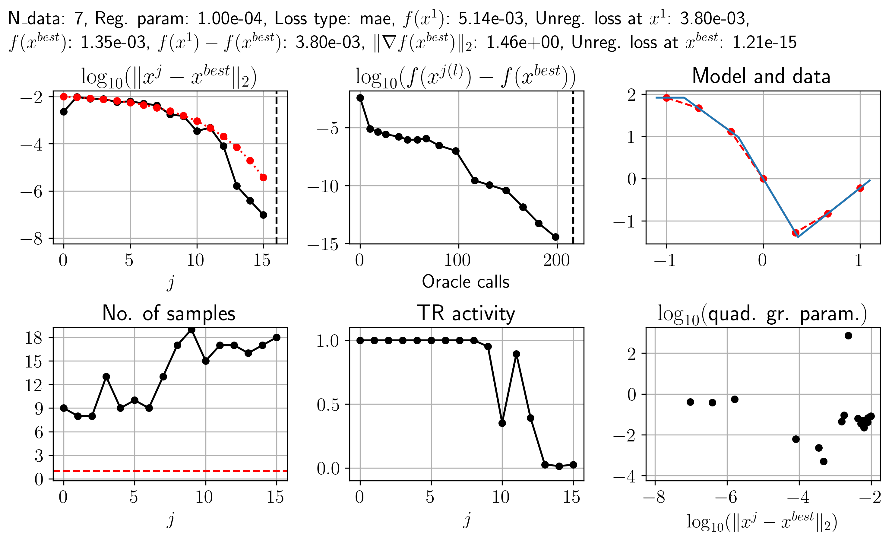
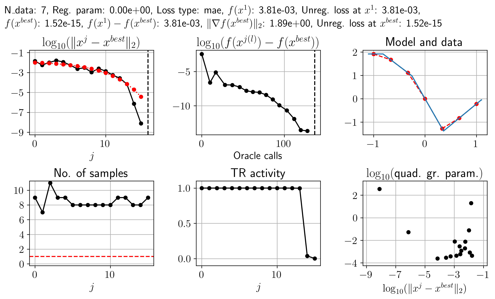
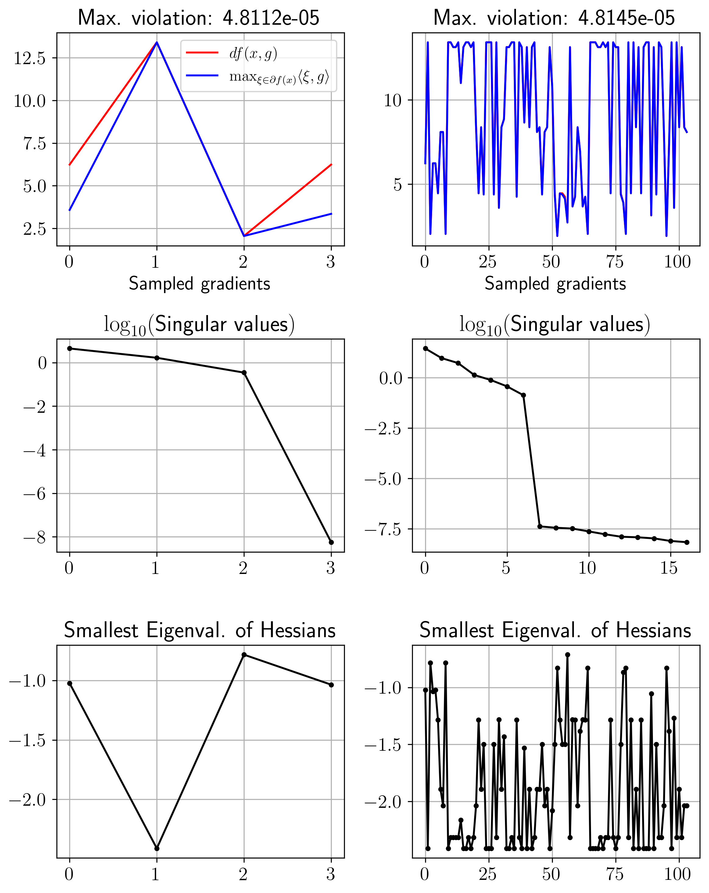
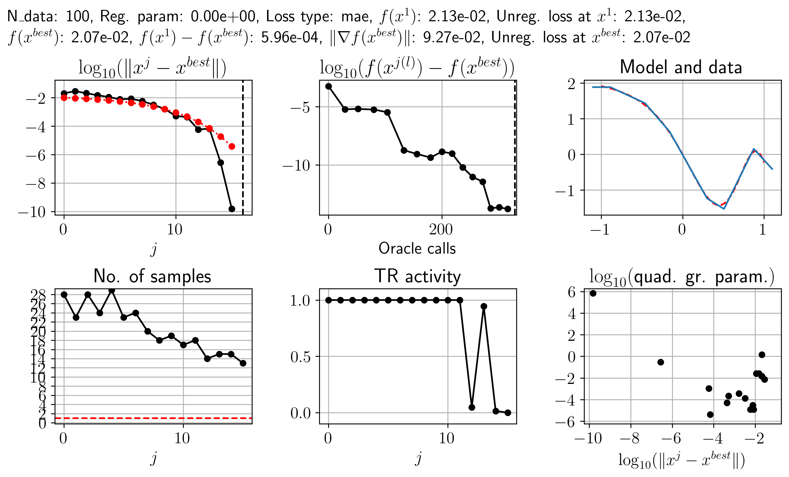
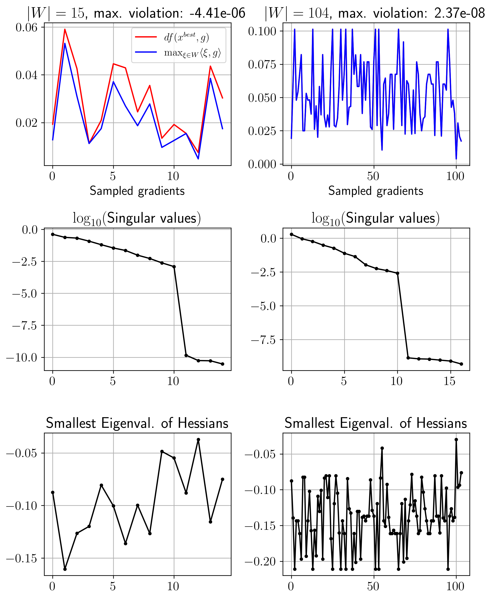

# Higher-order trust-region bundle method

A simple Python implementation of a trust-region bundle method using higher-order cutting-plane models (HTBM) for the solution of nonsmooth, nonconvex optimization problems. The trust-region subproblems are solved via _IPOPT_ (https://github.com/coin-or/Ipopt). The original Matlab implementation can be found at https://github.com/b-gebken/higher-order-trust-region-bundle-method, and the corresponding research articles are 

[GU2026a] Gebken, Ulbrich (2026): Superlinear convergence in nonsmooth optimization via higher-order cutting-plane models (https://arxiv.org/abs/2603.23236) 
[GU2026b] Gebken, Ulbrich (2026): Enclosing minima in nonsmooth optimization via trust regions of higher-order cutting-plane models (https://arxiv.org/abs/2603.23261) 

For testing purposes, Python implementations of BFGS and DGS (https://github.com/b-gebken/DGS) are included as well.

## Experiments on training neural networks

In the following experiments, we consider optimization problems that arise in the training of neural networks (NNs) for regression, where the parameters of the network are optimized so that it maps given input data as close as possible to given output data. There are multiple potential sources of nonsmoothness in this case:
1. The model resulting from the NN may be nonsmooth if nonsmooth activation functions (like the ReLU function) are used in the NN.
2. The loss function for measuring the difference between the image of the model and the data may be nonsmooth.
3. A nonsmooth regularizer (like the L1-norm of the weights) may be added to the loss function.

There are two questions we want to investigate with our experiments:
1. Does HTBM achieve superlinear convergence in this case?
2. What kind of (local) nonsmooth structure does the resulting (regularized) loss function have around its minima?

We emphasize that our first question is mainly of theoretical interest, as the HTBM (in its current form) is not well suited for this class of problems for various reasons:
- Global convergence to "good" solutions is typically more important than (fast) local convergence for these problems.
- The bundling procedure requires potentially many gradients and (full) Hessians to be computed and stored.
- The trust-region (TR) subproblems that arise are expensive to solve.

As such, we only consider small NNs. Furthermore, for simplicity, we do not implement the HTBM via PyTorch's Optimizer subclass. Instead, after creating the NN, we use the module src/htbm_py/test_functions/loss_NN.py to create an oracle that we can pass to a stand-alone version of the HTBM. This is likely far less efficient but allows us to work with the standard version of the HTBM. 

The details of our experiments are as follows:
- We consider a feed-forward NN with 1-3-2-1 neurons (i.e., one neuron in the input layer, three neurons in the first hidden layer, two neurons in the second hidden layer, and one neuron in the output layer). The weights (and biases) of this NN are denoted as a vector $x \in \mathbb{R}^{17}$. For each set of weights $x$, we denote the resulting model function by $F(x,\cdot)$. For the activation function we choose the ReLU function.
- For input data, we use equidistant points $t_i \in [-1,1]$, $i \in \\{1,\dots,N_\{data\}\\}$, and for the output data, we use $y_i = \sin(\pi \exp(t_i)) - t_i$. (See the images below for a visualization.)
- For the HTBM, we use the same parameters as in [GU2026a], Section 6, with $\varepsilon_{thr} = 10^{-6}$ as the smallest TR radius. Since we are only concerned with local convergence and the local nonsmooth structure, we choose an initial TR radius of $10^{-2}$ and an initial point $x^1$ whose distance to an approximated minimum (x_min in the code) is at most $10^{-3}$. (The approximated minima were computed beforehand through a combination of DGS, BFGS and HTBM.) The best point found by the specific run of the HTBM in an example is denoted by $x^{{best}}$. (For analyzing the speed of convergence, we will plot the values $\log_{10}(\\| x^j - x^{{best}} \\|_2)$. Since this is not well defined when $x^j = x^{{best}}$, a vertical dashed line is plotted for such $j$.) To make the behavior of the HTBM as easy to interpret as possible, we do not use random initial points for the bundle and do not reuse bundle information from memory (cf. [GU2026a], Remark 4.2(a)).
- For regularizing the loss function, we use the L1-norm $\\| x \\|\_1$ of the weights, multiplied by a regularization parameter $\lambda \geq 0$.
- The number of data points $N_{data}$, the type of loss function, and the regularization parameter $\lambda$ vary throughout the experiments.

### 1) Experiments with the mean squared error loss

We first consider the case where the loss function is the _mean squared error_ (MSE), such that the overall objective function is $f(x) = \frac{1}{N_{{data}}} \sum_{i = 1}^{N_{{data}}} \\| F(x,t_i) - y_i \\|\_2^2 + \lambda \\| x \\|_1$. In the first experiment, we consider $N\_{data} = 7$ data points and $\lambda = 10^{-4}$. The result is shown in Fig. 1.

  
   
  <strong>Figure 1.</strong>

Before interpreting the results, we first discuss our visualization:
- The top-left plot shows the convergence behavior of $(x^j)_j$ w.r.t. to the index $j$. By the theory of [GU2026a], under certain assumptions, this sequence converges locally R-superlinearly to a minimum.
- The top-middle plot shows the convergence behavior of the objective values w.r.t. the number of oracle calls, where $j(l)$ denotes the index $j$ of the HTBM in which the $l$-th oracle call occurred.
- The top-right plot shows the (connected) data points $(t_i,y_i)$ in red and the graph of the optimized model $F(x^{{best}},\cdot)$ in blue.
- The bottom-left plot shows, for each iteration of the HTBM, the size of the bundle that was required to build a "sufficiently good" higher-order cutting-plane model. (If this size is 1, then HTBM simply solves the subproblem of the classic trust-region Newton method to obtain the next iterate.)
- The bottom-middle plot shows the fraction $\frac{\\| x^{j+1} - x^j \\|\_2}{\varepsilon\_j}$, i.e., the fraction of the distance between iterates and the TR radius. A value less than 1 means that the TR radius is inactive in this iteration.
- Finally, the bottom-right plot shows, for each iterate $x^j$, the fraction $\frac{f(x^j) - f(x^{{best}})}{\\| x^j - x^{{best}} \\|\_2^2}$ plotted against $\log_{10}(\\| x^j - x^{{best}} \\|\_2)$, which can be used to get a rough idea of the order of growth of the objective function. However, since the minimum may not be unique and may even lie inside a continuous set of minima, this plot has limited meaning. 

Considering the specific results in Fig. 1, the top-left plot suggests (roughly) R-superlinear convergence of $(x^j)_j$, with significant decrease starting at $x^{9}$. As expected from the theory, the significant decrease starts exactly when the TR becomes inactive and the bundle size increases.

The fact that the bundle size is larger than one also suggests that $f$ is nonsmooth around the minimum. This is not surprising, since $\lambda > 0$ means that $f$ inherits the nonsmoothness of the L1-norm. To be able to detect the possible nonsmoothness of $f$ that is caused by the nonsmoothness of the ReLU activation function, we next consider the case where $\lambda = 0$. The result is shown in Fig. 2. 

  
   
  <strong>Figure 2.</strong>

As in Fig. 1, we see R-superlinear convergence of $(x^j)_j$. (Note that for $\\| x^j - x^{{best}} \\|\_2 < 10^{-10}$, the results are not meaningful due to the limited precision of the TR subproblem solution.) However, in contrast to the first experiment, the bundle size is constantly 1. This suggests that, despite the nonsmoothness of the ReLU activation function, $f$ is smooth around the minimum.

In the first two experiments, the number of data points was small enough for the model to be able to perfectly fit the data. For the final experiment with the MSE loss function, we choose $N_{data} = 100$ (with still $\lambda = 0$). 

  
   
  <strong>Figure 3.</strong>

We again see superlinear behavior of $(x^j)_j$ with the same lack of nonsmoothness as in the previous experiment.

### 2) Experiments with the mean absolute error loss

The apparent smoothness of the (unregularized) objective function in the above experiments may be related to the fact that the MSE loss squares the residuals. (For example, simply squaring the ReLU function leads to a continuously differentiable function.) To obtain a more interesting nonsmoothness, we now use the _mean absolute loss_ (MAE), where the resulting objective function is $f(x) = \frac{1}{N_{{data}}} \sum_{i = 1}^{N_{{data}}} \| F(x,t_i) - y_i \| + \lambda \\| x \\|_1$. For the first experiment, as in Fig. 1, we again consider $N\_{data} = 7$ data points and $\lambda = 10^{-4}$. The result is shown in Fig. 4.

  
   
  <strong>Figure 4.</strong>

As for the MSE loss, the result suggests R-superlinear convergence of $(x^j)\_j$, which again aligns with the inactivity of the TR constraint. However, the HTBM now requires a larger bundle size even for the first iterations, which suggests a more complicated nonsmooth structure.

As before, to filter out the nonsmoothness of the L1-norm, we now choose $\lambda = 0$. The result is shown in Fig. 5.

  
   
  <strong>Figure 5.</strong>

In contrast to Fig. 2, the bundle size is larger than 1, suggesting nonsmoothness of $f$ around the minimum.

To analyze the structure of the nonsmoothness, we use the deterministic gradient sampling mechanism of the DGS (https://github.com/b-gebken/DGS). Given any point $x$, this mechanism finds either a descent direction at $x$ or a vanishing convex combination of subgradients (forming a set $W$) sampled in an $\varepsilon$-ball around $x$. By applying it for $x = x^{{best}}$, it yields the latter, and the number of subgradients required for this convex combination can be seen as a measure of the complexity of the nonsmoothness. The results are shown in Fig. 6.

  
   
  <strong>Figure 6.</strong>

For each column in Fig. 6, the meaning of the three subplots is as follows:
- The first plot can be used to analyze whether $f$ is a lower-Ck function. For such functions and for any $x, v \in \mathbb{R}^n$, the directional derivative $df(x,v)$ is equal to $\max_{\xi \in \partial f(x)} \langle \xi, v \rangle$ (see Thm. 10.31 in [Rockafellar, Wets (1998)]). As a numerical approximation of this relationship, for each element $g \in W$ (on the horizontal axis), we check whether a finite difference approximation of $df(x^{{best}},g)$ (red) is greater or equal to $\max_{\xi \in W} \langle \xi, g \rangle$ (blue). The "violation" refers to the difference of the latter minus the former. If this violation is close to zero, then the above equality holds approximately (for this direction). Otherwise, the violation being negative means that a subgradient may be missing from the set $W$. Since some subgradients may not be needed to achieve a vanishing convex combination, this is not a problem. However, if the violation is positive (and not close to zero), then the above equation cannot hold, so the function cannot be lower-Ck.
- The second plot shows the singular values of the matrix whose columns are the subgradients in $W$. It can be used to obtain a lower bound for the (affine) dimension of the subdifferential at $x^{{best}}$.
- The third plot shows the smallest eigenvalue of the Hessian of $f$ at each of the sample points, where negative values indicate nonconvexity.

The left column in Fig. 6 shows the result for a standard call of the method, where it tries to sample as few subgradients as possible for the convex combination. In the first plot, we see that the above (approximated) necessary condition for $f$ being lower-Ck holds. The second plot gives the lower bound $3$ for the dimension of the subdifferential. The third plot suggests that $f$ is nonconvex. The right column in Fig. 6 shows a call of the method with warm-starting, where $W$ was initialized by $100$ random points from the $\varepsilon$-ball. We see that the necessary condition for lower-Ck is still holds, the lower bound of the dimension of the subdifferential is $7$ and $f$ again nonconvex at each sample point.

For the final experiment, we again increase the number of data points to $N_{data} = 100$. The result is shown in Fig. 7. 

  
   
  <strong>Figure 7.</strong>

We again see the expected superlinear behavior, but with a bundle size that is larger than the size in Fig. 5. This suggests that the complexity increases with the number of data points. To further analyze the nonsmoothness, we again use the deterministic sampling mechanism. The result is shown in Fig. 8.

  
   
  <strong>Figure 8.</strong>

The larger number of subgradients and the larger dimension of the subdifferential in the first two plots in both columns confirm the increased complexity compared to Fig. 6. As before, the third plot suggests nonconvexity of $f$.

## Conclusion

- The HTBM achieved (roughly) R-superlinear convergence in each experiment, and the bundle size and activity of the TR behaved as expected.
- For the MSE loss, the only source of nonsmoothness seems to be the regularization term, even when using the nonsmooth ReLU activation function.
- For the MAE loss, there is nonsmoothness even without a regularization term. In terms of the nonsmooth structure, our experiments suggest that the objective functions in this class of problems at least satisfy a numerically approximated necessary condition for being lower-Ck. However, we are unsure how close this numerical approximation is to the actual condition, so more research is required to come to a proper conclusion about the nonsmooth structure of these functions.
- We did not attempt to analyze the order of growth around the minima, as this is challenging to do numerically. Furthermore, for small numbers of data points, there is likely a continuous set of minima due to overfitting, in which case there is no (classic) growth. 

<h1>Acknowledgements</h1>
This research was funded by Deutsche Forschungsgemeinschaft (DFG, German Research Foundation) – Projektnummer 545166481.
